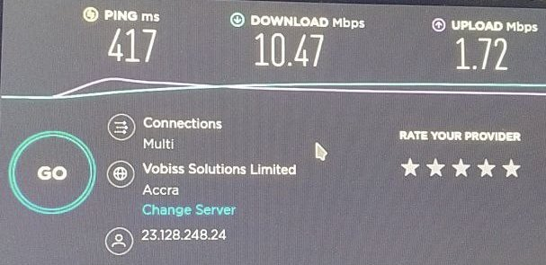

# TOR Box Next Generation 2
Almost OOB solution to create:
* TOR/I2P Wifi Access Point
* TOR/I2P Proxy On LAN
* Private TOR Bridge server

This is a successor of [TBNG](https://github.com/znoxx/tbng) project.

## Feature comparison with original TBNG project

TODO

## How it works

TODO

## Requirements

* Any SBC with at least 2 cores CPU and 512MB of RAM, Linux and Docker (and docker-compose). [Armbian](https://armbian.com) is a best bet here.
* Can run on smaller SBC without I2P functionality.
* For private bridge functionality one will need rented VPS (tested with single core, 256Mb cheap KVM box).
* For access point functionality one will need dedicated WAN interface, compatible with nl80211 driver.

## Host system preparation

### SBC preparation

* Make sure you can access Internet from SBC.
* Install docker (better to use latest version from docker.com).
* Install docker-compose. Can be installed via pip tool, install python3-cryptography from OS packages to avoid Rust compiler requirement.

```
# apt-get update
# apt-get install git curl python3-setuptools python3-pip python3-wheel python3-cryptography libffi-dev python3-dev
# curl https://get.docker.com |sh
# pip3 install docker-compose
```

* For AP support -- identify network interface to use for AP (LAN) and internet acess (WAN). 

### Building docker images

Clone the project, if not done before:
```
git clone https://github.com/znoxx/tbng2
cd tbng2
```
Source code is located in `dockerfiles` folder:

```
tbng-3proxy
tbng-ap
tbng-i2p
tbng-privoxy
tbng-tor
```
On SBC one should build following images (i2p may be skipped if no plans to use it):
```
tbng-ap
tbng-i2p
tbng-privoxy
tbng-tor
```

On dedicated server for private bridge one will need to build following images:
```
tbng-3proxy
tbng-tor
```

Build is relatively simple, just run supplied `build.sh` in appropriate folder:

```
cd dockerfiles/tbng-tor
./build.sh
```

### Configuring SBC
SBC-part is configured by editing config files and docker-compose files

TODO
### Running SBC part
TODO

## VPS part preparation
TODO

### Configuring private bridge (on VPS)
TODO

### Running private bridge
TODO

### Connecting to private bridge from SBC 
TODO

### Using private socks/http(s) proxy at VPS side
TODO

## Results

YMMV here. Generally, using private bridge for TOR gives good results. Here is a result of SpeedTest for a "nice day in TOR".




